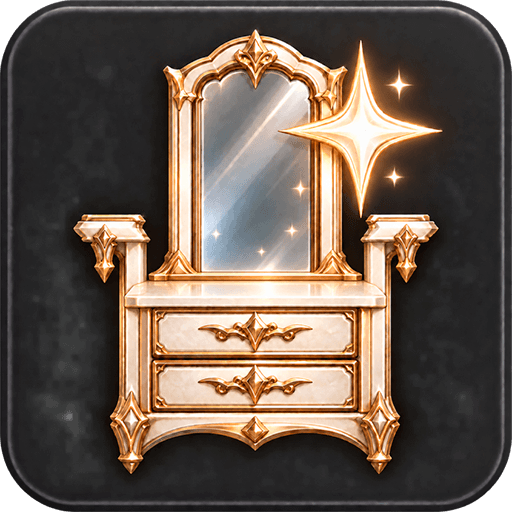
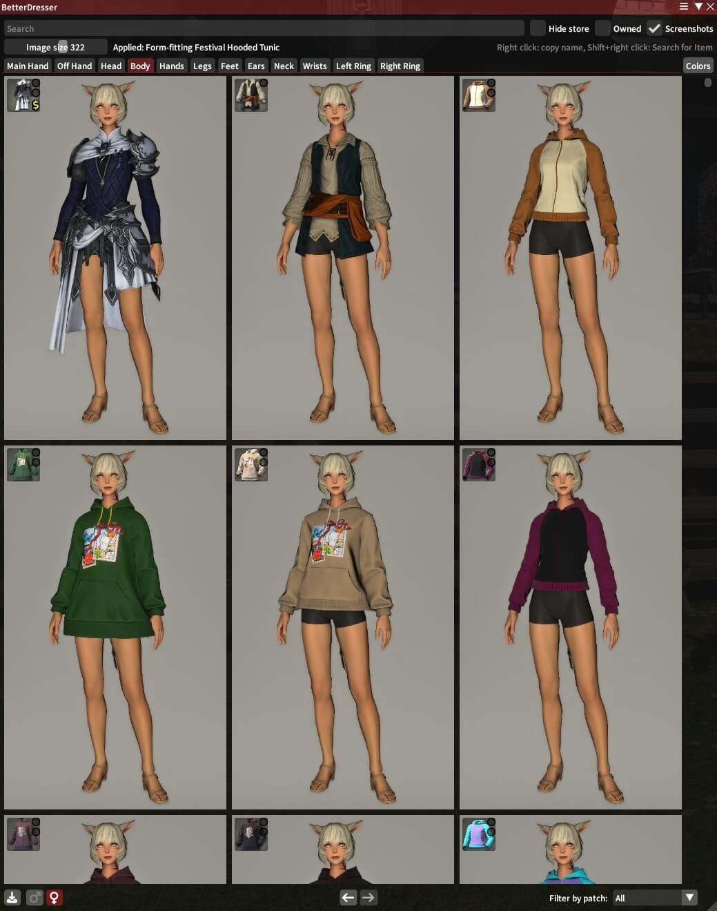

# BetterDresser

BetterDresser is a catalog of every piece of gear in FFXIV. Browse it by slot, see each item as a screenshot of the model,
and click to try it on your character with [Glamourer](https://github.com/Ottermandias/Glamourer). It is made for putting
glamours together: no more digging through the armoury chest, the dresser or wiki pages to see what something looks like.

## Installation

BetterDresser is a Dalamud plugin, so the game has to be started with [XIVLauncher](https://goatcorp.github.io/).
It also needs [Glamourer](https://github.com/Ottermandias/Glamourer) installed: Glamourer is what puts the items on.

1. Type `/xlsettings` in the chat box to open the Dalamud settings.
2. Go to the "Experimental" tab and scroll down to "Custom Plugin Repositories".
3. Paste the repo URL below into the empty field, **and press the "+" button next to it**.
4. Press "Save and Close".
5. Open the plugin installer with `/xlplugins`, search for BetterDresser and install it.

#### Repo URL

`https://raw.githubusercontent.com/CoffeeXIV/BetterDresser/main/repo.json`

## Usage

Open the catalog with `/bdresser` or `/betterdresser`.

- Gear is sorted into tabs by slot, newest items first. Weapons show only the ones your current job can use.
- **Click** an item to put it on. **Right click** copies its name, **Shift+right click** opens the game's "Search for Item" for it.
- The **← →** buttons at the bottom step back and forward through the items you have put on.
- While the catalog is open, the gear you put on stays through job and gearset changes. Once you close it, the gear turns
  temporary again, as usual with Glamourer: the next gear change in a slot replaces it.
- **Colors** opens the dyes of the gear you wear, with the game's palette. With **Keep colors** ticked, items you put on
  keep the slot's current dyes.
- Works in GPose too: it dresses your own character.

### Filters

- **Search** by name.
- **Owned**: only the items this character has, in the bags, armoury chest, equipped, with retainers, in the saddlebags,
  the glamour dresser and the armoire. Retainers, saddlebags and the dresser count once you have opened them;
  the armoire, once you have opened it at an inn.
- **Hide store**: hides Online Store items, which are marked with a yellow `$`. The list comes from the game's
  Dream Fitting, which misses some store items.
- **Filter by patch**: only items added in a given patch or expansion.

### Screenshots

By default items are shown as screenshots of their models; the **Screenshots** checkbox switches back to game icons.
**Image size** at the bottom sets the size of the tiles.

The screenshots come in packs: male clothes, female clothes, accessories and weapons. They are downloaded from the releases
of [BetterDresser-Packs](https://github.com/CoffeeXIV/BetterDresser-Packs) in the packs window, which opens the first time
you open the catalog, and later with the download button at the bottom left. Clothes are shown on your character's gender;
the ♂ and ♀ buttons next to it switch.

Game patches bring new gear, and new screenshots with it. The bottom bar tells you when an update is out, and only the
changed screenshots are downloaded.

### Network

BetterDresser asks GitHub for the list of screenshot pack releases when it loads and when you open the packs window
(at most once in five minutes), and downloads packs only when you press Download.

## Acknowledgements

- [Glamourer](https://github.com/Ottermandias/Glamourer) by Ottermandias, which does all the dressing.
- [xivapi/ffxiv-datamining-patches](https://github.com/xivapi/ffxiv-datamining-patches) for the patch each item came with.
- [Dalamud](https://github.com/goatcorp/Dalamud) and [FFXIVClientStructs](https://github.com/aers/FFXIVClientStructs).
